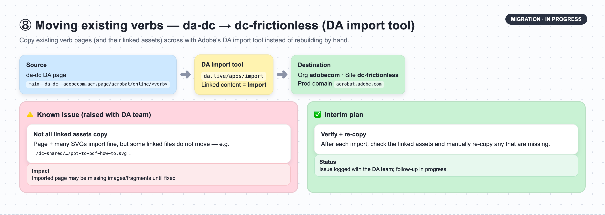

# Frictionless Verbs on acrobat.adobe.com — Domain Routing Strategy

> **What this document is.** Adobe's "frictionless verbs" are the quick PDF tools (Convert, Compress, HEIC→PDF, PPT→PDF, and so on). Today they live on **www.adobe.com**. We are moving them to **acrobat.adobe.com**. This document explains **how** to host them there, lays out the **options with their trade-offs**, and describes the two supporting pieces of work already under way. It is written to be understandable without a technical background — each major section opens with a plain-English summary.

---

## In short (summary)

- **The goal:** move Adobe's PDF "verb" tools from www.adobe.com to acrobat.adobe.com — safely, and in a way that is easy to repeat for each new verb.
- **Two design decisions** (independent of each other):
  - **Decision A — which workspace hosts the verbs:** keep a **dedicated `dc-frictionless` workspace** (Option A1) or **merge into the existing `da-dc` workspace** (Option A2). See Section 5.
  - **Decision B — the URL format:** verbs at the root vs under a shared folder. See Section 6.
- **Two supporting workstreams already in motion:**
  1. **Removing the "authored twice" overhead** — a traffic-routing fix is being validated on staging so each verb page only has to be created **once**, not twice (Section 4).
  2. **Moving existing verbs across** — using Adobe's DA "import" tool, with one known asset-copying issue being resolved with the DA team (Section 9).
- **On timing:** see the closing note (Section 11) on why the dedicated `dc-frictionless` path can start fastest.

---

## 1. Purpose

The frictionless verbs are today authored and delivered on **www.adobe.com**. We have begun moving them onto **acrobat.adobe.com**. The first verb hosted there for testing is:

```
https://acrobat.adobe.com/heic-to-pdf
```

We need a **repeatable, low-risk way** to migrate the remaining verbs so that:

- it does **not** put the live www.adobe.com experience at risk, and
- each additional verb is **easy** to add.

Two design questions come up, and they are **independent** of each other:

- **Decision A — Which workspace (repository) hosts the verbs?** (Section 5 )
- **Decision B — What do the page web addresses (URLs) look like?** (Section 6.)

The traffic-routing setup (Akamai, Section 7) then follows from those two choices.

---

## 2. A plain-language glossary

| Term | Plain-English meaning |
|------|-----------------------|
| **Verb** | A single PDF tool/page, e.g. "HEIC to PDF", "PPT to PDF". |
| **Repository ("repo")** | The workspace where the page code and content live. We have two: `da-dc` (for adobe.com) and `dc-frictionless` (for acrobat.adobe.com). |
| **EDS (Edge Delivery Services)** | Adobe's system for publishing and serving these pages. Both domains use it. |
| **DA (da.live)** | The tool authors use to edit, preview, and publish pages. |
| **Code root** | The web-address folder the page **code** loads from. On adobe.com it is `/acrobat` for  DC; on acrobat.adobe.com it is the new `/dc-shared` folder. This was done as we could not map /acrobat on acrobat.adobe.com akamai |
| **Akamai** | The "traffic cop" (CDN) in front of each domain that decides which server answers each web address. acrobat.adobe.com and www.adobe.com use **separate** Akamai configurations. |
| **EdgeWorker** | A small piece of code that runs at the traffic layer to pre-build the top visual of each verb page so it appears fast. |
| **Blast radius** | How much could break if a change goes wrong. "Small blast radius" = safe. |

**Why a separate workspace exists today:** acrobat.adobe.com needed the page **code** to load from a new folder (`/dc-shared`) that adobe.com's setup could not provide without conflicts. To enable that, the new **`dc-frictionless`** repository and its own DA authoring instance were created.There are some other config also added in dc-frictionless repo specific for acrobat.adobe.com for example to there is a config to make sure federal content loads from /dc-shared/* for akamai mapping purpose.

---

## 3. Current setup (how things work today)


**In plain English:** the two domains run on two separate workspaces, each with its own traffic-routing. They currently share the same front-end code, kept in each workspace.

| Attribute | www.adobe.com (live) | acrobat.adobe.com (new, in testing) |
|-----------|----------------------|-------------------------------------|
| Domain | `www.adobe.com` | `acrobat.adobe.com` (+ `stage.acrobat.adobe.com`) |
| Repository | `adobecom/da-dc` | `adobecom/dc-frictionless` (**this repo**) |
| Delivery server (EDS origin) | `main--da-dc--adobecom.aem.live` | `main--dc-frictionless--adobecom.aem.live` |
| Code root | `/acrobat` (da-dc's code root) | `/dc-shared/*` — the **new** code root, and the reason this repo was created |
| Example verb URL | `www.adobe.com/acrobat/online/<verb>` | `acrobat.adobe.com/heic-to-pdf` |
| Authoring | DA instance for `da-dc` | Separate DA instance for `dc-frictionless` |
| Akamai (traffic routing) | `www.adobe.com` property | **Separate** `acrobat.adobe.com` property |

```
        ┌───── Akamai routing: www.adobe.com ──────┐
        │  /acrobat/*  ─────►  main--da-dc--adobecom.aem.live   (authoring: da-dc)
        └───────────────────────────────────────────┘

        ┌───── Akamai routing: acrobat.adobe.com ──┐
        │  /heic-to-pdf ────►  main--dc-frictionless--adobecom.aem.live (authoring: dc-frictionless)
        └───────────────────────────────────────────┘
```

---

## 4. The "authored twice" problem — and the fix now in progress


**In plain English:** today, every verb page on acrobat.adobe.com has to be created **twice** — once for visitors, and once under /dc-shared/* folder — because of the way edgeworker has been enabled. This is extra work that grows with every verb. **We have found a fix that removes the second copy, we are working with acrobat team as that is an akamai config update on their side and will be testing it soon.**

### Why there are two copies today

The top visual of each verb page (the part that must load fast) is pre-built by a small piece of code called an **EdgeWorker** (its code lives in `main.js` in the `da-dc` repo and runs for both domains). To pre-build the page, the EdgeWorker has to **fetch the page itself**. But if it fetches the very same address it runs on, it triggers itself again — an **endless loop**.

To avoid the loop, it fetches a **different** address — one under the `/dc-shared/` folder. Today that means the page's content must **also be published under `/dc-shared/`**, i.e. a **second copy**:

1. **The visitor's page** — e.g. `acrobat.adobe.com/heic-to-pdf`, and
2. **A hidden duplicate under `/dc-shared/`** — the copy the EdgeWorker fetches to avoid the loop.

(On www.adobe.com this loop is avoided a different way — with a special request "flag" header, `X-EW-Frictionless-Page: true`. The Acrobat team did not want to reuse that flag approach on acrobat.adobe.com because it complicates their already-complex traffic caching rules.)

### The fix in progress — let Akamai remove the hidden folder from the address

Instead of publishing a real second copy, we keep only the **one real page** and let the traffic layer do the trick:

- The EdgeWorker still asks for the page using a `/dc-shared/…` address (so it does not trigger its own loop).
- **Akamai's "Modify Outgoing Request Path" behavior strips the `/dc-shared` part** off the address **before** the request reaches our server — so the server returns the **one real page**.
- This is **scoped to only the specific verb paths** where the EdgeWorker is enabled (not the entire `/dc-shared/` folder), so nothing else is affected.

**Result:** the duplicate copy is no longer needed — each verb is authored **once**.

**Status:** DevOps (Adam Peller) is setting this up on **Akamai staging for validation**. This fix works **regardless** of which repository (Decision A) or URL layout (Decision B) we choose.

> **Also note — the `/dc-shared/` folder is doing double duty.** On acrobat.adobe.com, the shared assets (Milo libs at `/dc-shared/libs/`, Unity libs at `/dc-shared/unitylibs/`, federal content at `/dc-shared/federal/`) are all served under this one folder to keep traffic routing simple. That asset consolidation is a *separate benefit*; the duplicate-page problem above is specifically about the EdgeWorker loop.

---

## 5. Decision A — Which repository hosts the verbs


**In plain English:** do we keep acrobat.adobe.com in its **own separate workspace** (A1), or **merge everything into the adobe.com workspace** (A2)? A1 keeps risk isolated; A2 removes some duplicate code but requires large, risky changes to the live adobe.com site.

### Option A1 — Dedicated repo (`dc-frictionless`)

Keep `adobecom/dc-frictionless` and its own authoring instance as the permanent home for all acrobat.adobe.com verbs. `da-dc` stays scoped to www.adobe.com.

| Pros | Cons |
|------|------|
| **Risk stays isolated** — a mistake here **cannot** break www.adobe.com. | **Code duplication:** the shared `/dc-shared/*` code must be kept in sync between the two repos. |
| **Independent** release schedule, testing, and permissions. | **Two authoring instances** for content teams to manage. |
| **No dependency** on the acrobat.adobe.com team completing Akamai/code-root changes — we can proceed now. | Some **duplicated automation** (testing, publishing pipelines). |
| Free to evolve acrobat.adobe.com's URL layout without touching adobe.com. | |

### Option A2 — Reuse `da-dc` for both domains

Serve acrobat.adobe.com verbs from the existing `da-dc` repo. In theory this removes the duplicate code, but reaching that state requires two large, live-site-touching changes:

- **Blocker 1 — code-root migration (touches the live adobe.com site).** adobe.com serves its page code from the **`/acrobat`** folder. The `/dc-shared` folder was created specifically to get acrobat.adobe.com off `/acrobat`. Merging both onto one `/dc-shared` means **re-pointing every adobe.com PDF page** to the new code folder — a project-wide change, a www.adobe.com Akamai update, and a **full re-test of the live adobe.com experience**. Large, slow, risky.

| Pros | Cons |
|------|------|
| Single copy of the shared code (no drift). | **Large, risky migration** touching live adobe.com (Blocker 1). |
| One authoring instance, one set of pipelines. | **Shared blast radius** — a bad shared-code change hits **both** domains. |
| Lower long-term maintenance *once achieved*. | The `/acrobat` address collision (Blocker 2) needs extra routing work. |

**Bottom line:** A2's savings are real, but they come only **after** large changes to the live adobe.com site (Blockers 1 and 2). A1 keeps all change surface **off** the live adobe.com experience, at the cost of maintaining the shared code in two workspaces.

---

## 6. Decision B — What the verb URLs look like


**In plain English:** this only affects the **web address format** and how much traffic-routing setup each new verb needs. It does **not** affect the "authored twice" work (Section 4). It is a smaller, separable decision.

Two practical layouts (a third combines them):

- **B1 — Root-level:** `acrobat.adobe.com/heic-to-pdf` — shortest, cleanest address; but the acrobat.adobe.com root is shared with the Acrobat app, so **each verb needs its own routing rule** and a collision check.
- **B2 — Shared folder:** `acrobat.adobe.com/<shared-folder>/heic-to-pdf` — one routing rule covers **all** current and future verbs; longer address; the existing `/heic-to-pdf` test URL would need a redirect.
- **B3 — Hybrid:** serve under the `/shared-folder/*` folder but show a clean short address via a traffic-layer redirect (needs SEO "canonical" tags).

| Layout | Routing work per new verb | Address collision risk | Address cleanliness |
|--------|---------------------------|------------------------|---------------------|
| B1 Root-level | New rule for each verb | Higher (shared root) | Best |
| B2 Shared folder | **None** (one rule covers all) | Low | Longer |
| B3 Hybrid | Small redirect per verb | Low | Best (with redirect) |

> **Note:** the "authored twice" overhead is the **same** for all three layouts, and it is addressed by the Section 4 fix — not by this decision.

*(A deeper technical side-by-side of the two hosting paths is in the board `06-hosting-paths-deepdive.png`.)*

---

## 7. Akamai routing (acrobat.adobe.com)


**In plain English:** acrobat.adobe.com has its **own** traffic-routing configuration. To host the verbs, it needs a handful of rules — send the verb addresses and the `/dc-shared` code folder to our server, handle staging, and (once ready) apply the Section 4 path-strip fix.

With the recommended **A1** setup, the routing points at `main--dc-frictionless--adobecom.aem.live`.

**Checklist for the acrobat.adobe.com Akamai property:**

- [ ] Route the verb address(es) → `dc-frictionless` server (per the chosen B1/B2 layout).
- [ ] Route the `/dc-shared/*` code folder → `dc-frictionless` server.
- [ ] Apply the **"Modify Outgoing Request Path"** rule to strip `/dc-shared` for the EdgeWorker-enabled verb paths (Section 4 fix) — validate on staging.
- [ ] Route `stage.acrobat.adobe.com` → the staging server.
- [ ] Configure caching and cache-clear.
- [ ] Confirm redirects (trailing slash, locale) behave correctly.

---

## 8. Options at a glance (repo × URL layout)


**In plain English:** the grid below shows every combination. The only per-verb effort that varies is traffic-routing work; the "authored twice" work is being removed for everyone by the Section 4 fix.

| Repo | URL layout | Routing work per new verb | Risk to live adobe.com |
|------|-----------|---------------------------|------------------------|
| A1 dedicated | B1 root | New rule per verb | **None** (isolated) |
| A1 dedicated | B2 folder | None (one rule) | **None** (isolated) |
| A2 reuse da-dc | B1 root | New rule per verb | High (touches adobe.com) |
| A2 reuse da-dc | B2 folder | None (one rule) | High (touches adobe.com) |

---

## 9. Moving existing verbs from da-dc to dc-frictionless



**In plain English:** we already have many verb pages on adobe.com. Rather than rebuilding each one by hand on acrobat.adobe.com, we use Adobe's **DA "import" tool** to copy the pages — and their linked images/fragments — from the `da-dc` authoring instance into the `dc-frictionless` authoring instance. This mostly works; one asset-copying gap is being fixed with the DA team.

**Tool:** DA Import — <https://da.live/apps/import>

**How it is used:**

| Setting | Value |
|---------|-------|
| Source page | e.g. `main--da-dc--adobecom.aem.page/acrobat/online/ppt-to-pdf` |
| Linked content | **Import** (also pulls in fragments, SVGs, PDFs) |
| Production domain | `https://acrobat.adobe.com` |
| Into — Organization | `adobecom` |
| Into — Site | `dc-frictionless` |

**Known issue (being followed up with the DA team):** even with "import linked content" selected, **not all linked assets are copied.** In a test import of `…/acrobat/online/ppt-to-pdf`, the page and many SVGs imported successfully, but at least one linked asset — `…/dc-shared/…/ppt-to-pdf-how-to.svg` — **did not move**. This has been raised with the DA team and is being followed up.

**Interim plan:** until the tool is fixed, after each import **verify the linked assets** and manually re-copy any that are missing.

---

## 10. Open questions (to confirm)

- **URL layout (Decision B):** confirm B1 (root) vs B2 (`/<shared-folder>>/` folder) for the public addresses.
- **Section 4 fix validation:** confirm the Akamai "Modify Outgoing Request Path" strip works correctly on staging for the EdgeWorker-enabled verb paths (owner: DevOps / Adam Peller).
- **DA import asset gap (Section 9):** track the DA-team fix for linked assets that do not copy.

---

## 11. Next steps

1. **Decide Decision A (workspace) and Decision B (URL layout)** with the DC, DevOps, and Content/DA owners.
2. **Validate the Section 4 fix on staging** (Akamai path-strip) so future verbs are authored only once.
3. **Set up the acrobat.adobe.com Akamai routing** (Section 7) on staging for the chosen layout.
4. **Pilot-migrate the next verb** using the DA import tool (Section 9); verify all linked assets copied.
5. **Roll out the remaining verbs** following the chosen model.

### A note on timing

If speed is a priority, the **dedicated `dc-frictionless` workspace (Option A1)** can start the fastest: the full setup — the repository, the `/dc-shared` code root, the separate DA authoring instance, and the acrobat.adobe.com Akamai routing — **already exists and is proven** for the `heic-to-pdf` test verb. Additional verbs can be migrated onto that same, working setup with **no new infrastructure**. The `da-dc` merge (Option A2), by contrast, would first require the large, live-adobe.com-touching changes described in Section 5 before any verb could ship.
