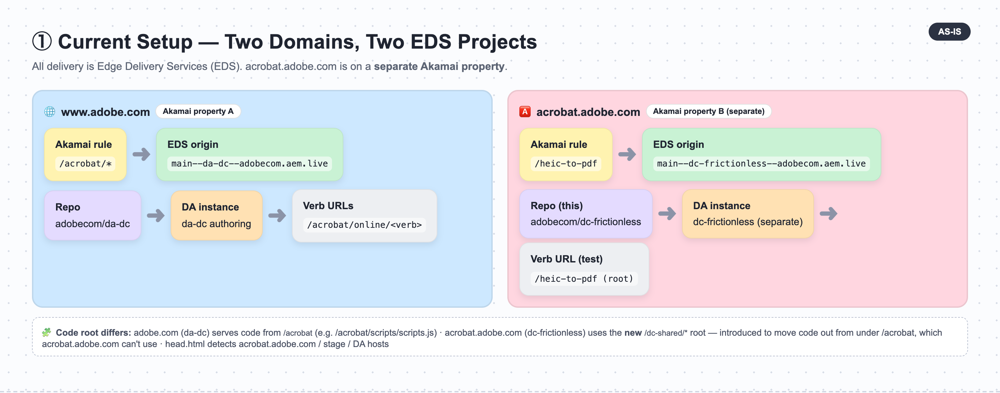
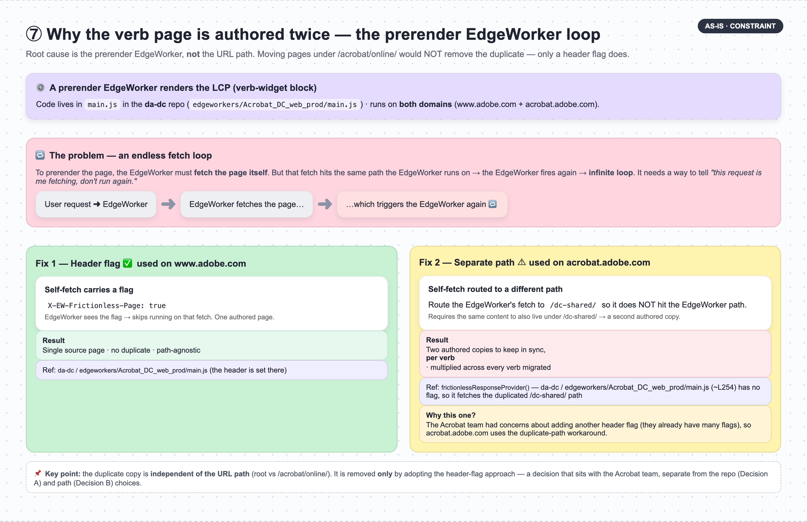
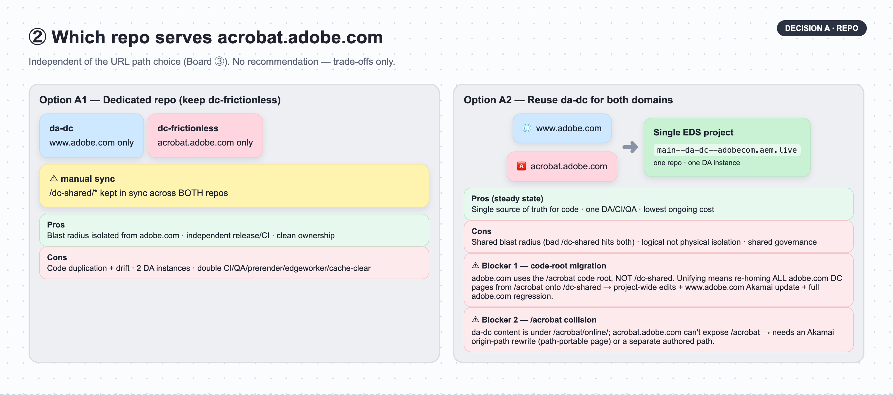
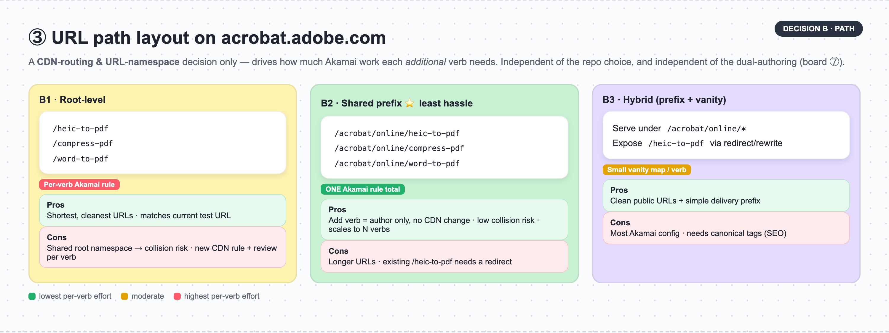
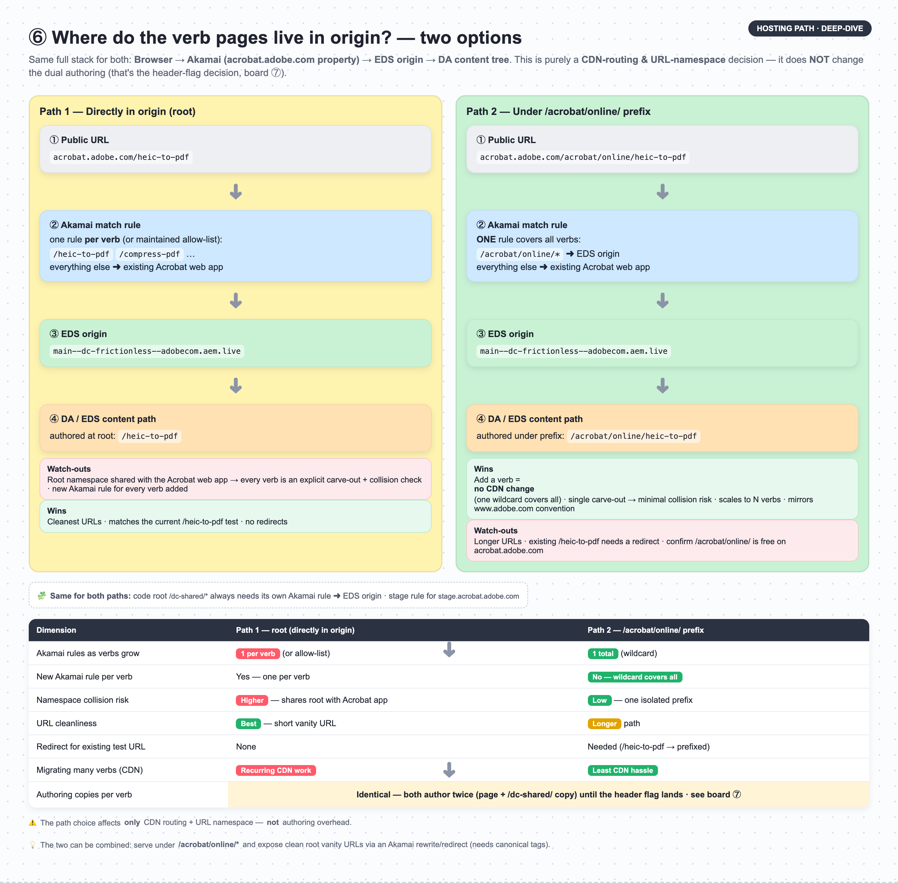
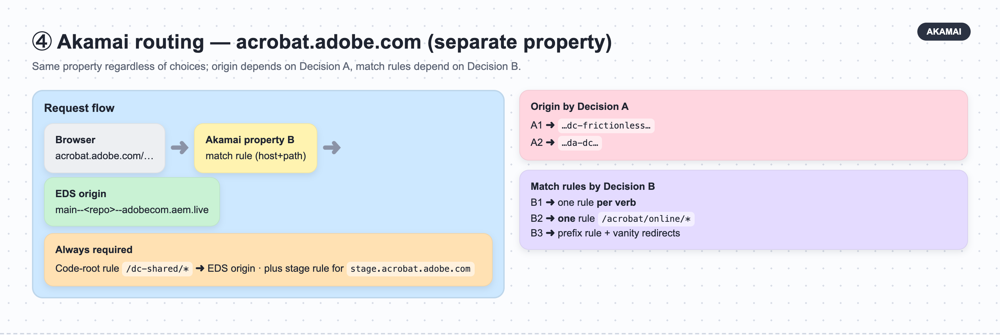
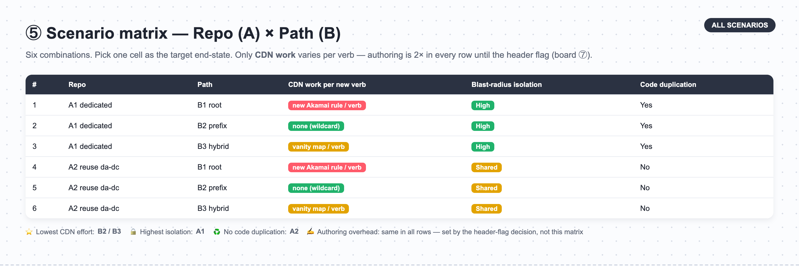

# Frictionless Verbs on acrobat.adobe.com — Domain Routing Strategy

> This document lays out **all viable scenarios** for hosting frictionless verbs on `acrobat.adobe.com` as we migrate **more verbs** over time. It makes **no recommendation** — each option is presented with its trade-offs so the team can decide. Items we still need to confirm are collected in **Section 8 Open Questions** rather than assumed.

---

## 1. Purpose

The frictionless verbs (Convert, Compress, HEIC→PDF, etc.) are today authored and delivered on **`www.adobe.com`**. We have begun moving verbs onto **`acrobat.adobe.com`**. The first verb hosted there for testing is:

```
https://acrobat.adobe.com/heic-to-pdf
```

We need a **repeatable strategy** so that migrating *additional* verbs to `acrobat.adobe.com` is low-effort and low-risk, and so it does not impact the existing `www.adobe.com` experience.

Two decisions drive everything and are **independent** of each other:

- **Decision A — Which repo / EDS project** serves acrobat.adobe.com (Section 4).
- **Decision B — Which URL path layout** the verbs use on acrobat.adobe.com (Section 5).

Akamai routing (Section 6) then follows from those two choices.

---

## 2. Background & Terminology

| Term | Meaning |
|------|---------|
| **EDS (Edge Delivery Services)** | Adobe's document-based publishing/delivery platform (`*.aem.live`). Both domains are served via EDS. |
| **DA (da.live)** | Document Authoring surface where content is edited, previewed, and published into an EDS project. |
| **Code root** | The path prefix from which **code** (blocks, scripts, libs) is served — here `/dc-shared/…`. |
| **Content root** | The path prefix under which **authored pages** (the verbs) live. |
| **EDS origin** | The delivery host for a repo, of the form `main--<repo>--adobecom.aem.live`. |
| **Akamai** | The CDN in front of both domains. `acrobat.adobe.com` is served by a **separate Akamai property** from `www.adobe.com`. |

**Why a separate repo/DA exists today:** `acrobat.adobe.com` required a **different path layout (new "code root")** than the `www.adobe.com` tree could accommodate without collisions. To enable that, a new repo — **`adobecom/dc-frictionless`** — and a **separate DA instance** were created. The shared front-end code is served from `/dc-shared/*` in both repos, and `head.html` already detects `acrobat.adobe.com` / `stage.acrobat.adobe.com` / DA (`.da.`) hosts at runtime.

---

> **Visual boards** (Miro-style) for every section below are in [`docs/diagrams/`](docs/diagrams/) as PNGs — drag them straight into SharePoint:
> `01-current-setup.png` · `07-edgeworker-dcshared.png` · `02-decision-A-repo.png` · `03-decision-B-path.png` · `06-hosting-paths-deepdive.png` · `04-akamai-routing.png` · `05-scenario-matrix.png`

## 3. Current Setup (as-is)



| Attribute | www.adobe.com (live) | acrobat.adobe.com (new, test) |
|-----------|----------------------|-------------------------------|
| Domain | `www.adobe.com` | `acrobat.adobe.com` (+ `stage.acrobat.adobe.com`) |
| Repo | `adobecom/da-dc` | `adobecom/dc-frictionless` (**this repo**) |
| EDS origin | `main--da-dc--adobecom.aem.live` | `main--dc-frictionless--adobecom.aem.live` |
| Code root | `/acrobat` (da-dc's code root) | `/dc-shared/*` — the **new** code root introduced for acrobat.adobe.com (the reason this repo was created) |
| Verb URL example | `www.adobe.com/acrobat/online/<verb>` (existing convention) | `acrobat.adobe.com/heic-to-pdf` (root-level) |
| Authoring | DA instance for `da-dc` | Separate DA instance for `dc-frictionless` |
| Akamai | `www.adobe.com` property | **Separate** `acrobat.adobe.com` property |

```
        ┌───── Akamai property: www.adobe.com ─────┐
        │  /acrobat/*  ─────►  main--da-dc--adobecom.aem.live   (DA: da-dc)
        └──────────────────────────────────────────┘

        ┌───── Akamai property: acrobat.adobe.com ─┐
        │  /heic-to-pdf ────►  main--dc-frictionless--adobecom.aem.live (DA: dc-frictionless)
        └──────────────────────────────────────────┘
```

### 3.5 Why verb pages are authored twice — the prerender EdgeWorker loop (current constraint)



A detail that shapes the strategy — and one that is **independent of the URL path**. The **LCP (the verb-widget block) is rendered by a prerender EdgeWorker**, whose code lives in **`main.js` in the `da-dc` repo** (`edgeworkers/Acrobat_DC_web_prod/main.js`) and runs for verbs on **both domains** (www.adobe.com and acrobat.adobe.com).

**The problem — an endless fetch loop.** To prerender a page, the EdgeWorker must **fetch the page itself**. That fetch hits the same path the EdgeWorker runs on, which triggers the EdgeWorker again — an infinite loop. The EdgeWorker needs a way to recognise *"this request is me fetching — don't run again."* There are two ways to break the loop:

- **Fix 1 — header flag (used on www.adobe.com).** The self-fetch carries a header, `X-EW-Frictionless-Page: true`. When the EdgeWorker sees the flag it skips running on that request. Result: **one authored page**, and it is path-agnostic. (The header is set in `da-dc / edgeworkers/Acrobat_DC_web_prod/main.js`.)
- **Fix 2 — separate path (used on acrobat.adobe.com).** The self-fetch is routed to a **different path — `/dc-shared/`** — so it does not hit the EdgeWorker path. This requires the **same content to also exist under `/dc-shared/`**, i.e. a **second authored copy**. The dc-frictionless handler `frictionlessResponseProvider()` (around line 254 of the same `main.js`) has **no flag**, so it fetches from the duplicated `/dc-shared/` path.

**Why Fix 2 on acrobat.adobe.com:** the Acrobat team had concerns about adding another header flag (they already have many flags), so acrobat.adobe.com uses the duplicate-path workaround instead.

**Consequence — each verb page is authored twice:**

1. **The visitor's page** — e.g. `acrobat.adobe.com/heic-to-pdf`, and
2. **A duplicate under `/dc-shared/`** — the copy the prerender EdgeWorker fetches to avoid the loop.

This dual authoring is a **key friction point** that multiplies with every verb migrated. **Crucially, it is not caused by the page being at the root, and it is not fixed by the repo (Section 4) or path (Section 5) choices.** Moving pages under `/acrobat/online/` would keep the duplicate. It is removed **only** by adopting the header-flag approach — a decision that sits with the Acrobat team.

> **Note on the `/dc-shared/` mapping.** On the acrobat.adobe.com Akamai property, shared assets are also consolidated under the same `/dc-shared/*` prefix (Milo libs at `/dc-shared/libs/`, Unity libs at `/dc-shared/unitylibs/`, federal content at `/dc-shared/federal/`) to avoid registering many separate path rules. This asset consolidation is a separate benefit; the *duplicate page authoring* above is specifically driven by the prerender loop, not by the asset mapping.

---

## 4. Decision A — Which repo serves acrobat.adobe.com



### Option A1 — Dedicated repo (`dc-frictionless`) — *continue current model*

Keep `adobecom/dc-frictionless` + its own DA instance as the permanent home for all acrobat.adobe.com verbs. `da-dc` stays scoped to `www.adobe.com`.

| Pros | Cons |
|------|------|
| Deploy **blast radius isolated** from www.adobe.com — a bad change here cannot break adobe.com. | **Code duplication:** `/dc-shared/*` must be kept in sync between `da-dc` and `dc-frictionless`; drift risk on every change. |
| Independent release cadence, CI/CD, and permissions per domain. | **Two DA instances** — content teams manage two authoring surfaces. |
| Clean separation of ownership. | **Double the CI/CD, Nala/QA, prerender, edgeworker, cache-clear workflows.** |
| Free to evolve acrobat.adobe.com path layout without touching adobe.com. | Higher long-term operational cost as more verbs are added. |

### Option A2 — Reuse `da-dc` for both domains

Serve acrobat.adobe.com verbs from the **existing `da-dc` repo**, with a single shared code root and verbs authored in the same DA tree. Retire `dc-frictionless` and its separate DA instance.

EDS resolves **code root** and **content root** independently and a single EDS project can serve **multiple domains**. In principle one repo can back both `www.adobe.com` and `acrobat.adobe.com`. In practice there are **two structural blockers** that make this expensive — see below.

| Pros | Cons |
|------|------|
| **Single source of truth for code** — one `/dc-shared/*` instead of mirroring it across two repos (no ongoing drift). | **Large one-time migration** to reach that single source of truth — see "code-root migration" note below. |
| **One DA instance**, one CI/CD, one QA pipeline. | **Shared blast radius:** a bad `/dc-shared/*` change can affect **both** domains at once. |
| Lower operational cost as verb count grows. | Isolation is **logical** (path + hostname guards) not **physical** (separate repo). |
| | Governance/access control is shared; relies on path-level review discipline. |
| | **Content-path collision:** acrobat.adobe.com cannot expose `/acrobat/*` (already the Acrobat web app), so serving da-dc's `/acrobat/online/…` content there needs an Akamai origin-path rewrite or a separate authored path — see below. |

> **Blocker 1 — code-root migration (project-wide, touches live adobe.com).** adobe.com (da-dc) serves code from the **`/acrobat` code root**. The `/dc-shared/*` code root is the **new** path introduced for acrobat.adobe.com precisely to move code out from under `/acrobat` (which acrobat.adobe.com cannot use — see Blocker 2). Consolidating both domains onto one `/dc-shared` therefore means **re-homing every adobe.com DC page from the `/acrobat` code root onto `/dc-shared`**: a **project-wide, multi-file change**, an update to the **www.adobe.com Akamai mapping**, and a **full regression across the live adobe.com DC experience**. This is a large one-time blast radius, on top of the ongoing shared-radius risk. If this migration is out of scope, A2's "single source of truth for code" is **not attainable**.

> **Blocker 2 — content-path collision (the `/acrobat` problem).** da-dc's verb content lives under `/acrobat/online/…`. acrobat.adobe.com cannot map `/acrobat/*` (it is very likely already the Acrobat web app), so A2 additionally requires either an **Akamai origin-path rewrite on the acrobat.adobe.com property** (public URL → `/acrobat/online/…` origin path; keeps single authoring but needs the page to be path-portable — canonical/links/sitemap), **or** authoring the acrobat verbs at a **separate non-colliding path** in the same repo (keeps one repo/CI but gives up author-once). Note: solving this by *restructuring da-dc's shared paths* would again drag in the adobe.com blast radius of Blocker 1 — **avoid that approach**.

**Net:** A2's headline benefits (no duplication, one CI, one DA) are real, but reaching them is **not additive** — it requires a code-root migration that touches the live adobe.com tree (Blocker 1) plus a content-routing solution for the `/acrobat` collision (Blocker 2). **If minimizing adobe.com blast radius is the priority, A1 keeps all change surface off the live adobe.com experience.**

---

## 5. Decision B — URL path layout on acrobat.adobe.com



Independent of the repo choice. This is **purely a CDN-routing and URL-namespace decision** — the difference is **Akamai routing effort**, **namespace-collision risk**, and **URL cleanliness** as more verbs are added.

> **Important — the path choice does *not* change the dual authoring.** Whether verbs sit at the root or under `/acrobat/online/`, each page is still authored twice (the page + its `/dc-shared/` copy) because of the prerender EdgeWorker loop (Section 3.5). That duplicate is removed only by the header-flag decision, which is independent of this section. So do not weigh "authoring effort" when choosing between B1, B2, and B3 — only CDN/URL factors differ.

### Option B1 — Root-level verbs (current test model)

```
acrobat.adobe.com/heic-to-pdf
acrobat.adobe.com/compress-pdf
acrobat.adobe.com/word-to-pdf
```

| Pros | Cons |
|------|------|
| Shortest, cleanest, most marketable URLs. | `acrobat.adobe.com` root namespace is **shared with the existing Acrobat web product** and other routes — every verb path must be explicitly carved out and must **not collide** with existing routes. |
| Matches the URL already used for the HEIC→PDF test. | **Per-verb Akamai effort:** each new verb needs a new match rule (or an actively maintained allow-list) on the acrobat.adobe.com property. |
| | Higher coordination with whoever owns the acrobat.adobe.com root namespace. |
| | Migrating *more* verbs = recurring CDN + namespace review each time. |

### Option B2 — Single shared prefix (e.g. `/acrobat/online/*`)

```
acrobat.adobe.com/acrobat/online/heic-to-pdf
acrobat.adobe.com/acrobat/online/compress-pdf
acrobat.adobe.com/acrobat/online/word-to-pdf
```
*(exact prefix TBD — see Section 8)*

| Pros | Cons |
|------|------|
| **One Akamai match rule** for the whole prefix — adding a verb needs **no new CDN rule** (the wildcard already covers it). **Lowest CDN hassle for migrating many verbs.** *(Authoring is unchanged — still two copies per Section 3.5 until the header flag.)* | Longer, less clean URLs than root-level. |
| One carved-out prefix → **minimal namespace-collision risk** with existing acrobat.adobe.com routes. | The existing test URL `acrobat.adobe.com/heic-to-pdf` is root-level, so it would need a **redirect** to the prefixed URL. |
| Mirrors the `/acrobat/online/*` convention already used on www.adobe.com → consistent authoring mental model. | May not match desired marketing/SEO vanity URL without additional redirect/rewrite. |
| Scales cleanly: N verbs, still one rule. | |

### Option B3 — Root-level vanity URL + shared delivery prefix (hybrid)

Author/serve verbs under a shared prefix (B2) for delivery simplicity, but expose **clean root-level vanity URLs** (B1) via Akamai rewrite/redirect.

| Pros | Cons |
|------|------|
| Clean public URLs **and** one delivery prefix behind the scenes. | Most Akamai config complexity (rewrite/redirect rules + canonical/SEO handling). |
| New verb = author under prefix + add one small vanity mapping. | Two URLs per verb (vanity + canonical) — must set canonical tags to avoid SEO duplication. |

### Path-layout summary — CDN/URL differences per *additional* verb

*(Authoring effort is identical across all three — see Section 3.5 — so it is not a differentiator here.)*

| Layout | New Akamai work per verb | Namespace-collision risk | URL cleanliness |
|--------|--------------------------|--------------------------|-----------------|
| B1 Root-level | Per-verb rule / allow-list update | Higher (shared root) | Best |
| B2 Shared prefix | **None** (one rule covers all) | Low | Longer |
| B3 Hybrid | Small vanity mapping per verb | Low (delivery), managed at edge | Best (with redirect) |

### 5.4 Deep-dive — where the verb pages live in origin (the two hosting paths)

The core question is **where in the origin the verb pages are authored**. Both options ride the *same* full stack — **Browser → Akamai (acrobat.adobe.com property) → EDS origin → DA content tree** — only the path differs.



**Path 1 — Directly in origin (root)** — pages authored at the origin root; public URL is the current test model.

| Stage | Value |
|-------|-------|
| Public URL | `acrobat.adobe.com/heic-to-pdf` |
| Akamai match rule | One rule **per verb** (or a maintained allow-list): `/heic-to-pdf`, `/compress-pdf`, … → EDS origin; everything else → existing Acrobat web app |
| EDS origin | `main--dc-frictionless--adobecom.aem.live` |
| DA / EDS content path | Authored at root: `/heic-to-pdf` |

**Path 2 — Under `/acrobat/online/` prefix** — pages authored under a single carved-out prefix.

| Stage | Value |
|-------|-------|
| Public URL | `acrobat.adobe.com/acrobat/online/heic-to-pdf` |
| Akamai match rule | **One** rule covers all verbs: `/acrobat/online/*` → EDS origin; everything else → existing Acrobat web app |
| EDS origin | `main--dc-frictionless--adobecom.aem.live` |
| DA / EDS content path | Authored under prefix: `/acrobat/online/heic-to-pdf` |

> **Same for both paths:** the code root `/dc-shared/*` always needs its own Akamai rule → EDS origin, plus a stage rule for `stage.acrobat.adobe.com`.

**Side-by-side**

| Dimension | Path 1 — root (directly in origin) | Path 2 — `/acrobat/online/` prefix |
|-----------|-----------------------------------|------------------------------------|
| Akamai rules as verbs grow | 1 per verb (or allow-list) | **1 total** (wildcard) |
| Add a new verb | Author page **+** new/updated Akamai rule | **Author page only** |
| Namespace collision risk | Higher — shares root with Acrobat web app | Low — one isolated prefix |
| URL cleanliness | Best — short vanity URL | Longer path |
| Redirect for existing test URL | None | Needed (`/heic-to-pdf` → prefixed) |
| Migrating many verbs | Recurring CDN work | **Least hassle** |

> **These map to the layout options above:** Path 1 = **B1**, Path 2 = **B2**. They can also be combined (**B3**): author under `/acrobat/online/*` for delivery simplicity while exposing clean root vanity URLs via an Akamai rewrite/redirect (set canonical tags to avoid SEO duplication).

---

## 6. Akamai Mapping (acrobat.adobe.com — separate property)



`acrobat.adobe.com` is served by its **own Akamai property**, configured independently of `www.adobe.com`. Whatever repo (A1/A2) and path (B1/B2/B3) we choose, the property needs:

1. **Content routing** — a match rule sending the verb path(s) to the chosen EDS origin.
2. **Code-root routing** — `/dc-shared/*` must also route to the same EDS origin (code is served from that prefix on this domain too).
3. **Stage routing** — `stage.acrobat.adobe.com` → the corresponding stage/preview origin.
4. **Caching & purge** — TTL aligned with EDS cache headers; purge wired to the repo's cache-clear workflow.

### 6.1 Origin per repo choice

| Repo choice | EDS origin the acrobat.adobe.com property points to |
|-------------|-----------------------------------------------------|
| A1 — dedicated | `main--dc-frictionless--adobecom.aem.live` |
| A2 — reuse da-dc | `main--da-dc--adobecom.aem.live` |

*(stage origin host naming — see Section 8)*

### 6.2 Match rules per path choice

| Path choice | Match rule(s) on acrobat.adobe.com property |
|-------------|---------------------------------------------|
| B1 — root-level | One rule **per verb** (or a maintained path allow-list), e.g. `/heic-to-pdf`, `/compress-pdf`, … → EDS origin |
| B2 — shared prefix | **One rule**: `/acrobat/online/*` → EDS origin (covers all current + future verbs) |
| B3 — hybrid | `/acrobat/online/*` → EDS origin **plus** per-verb vanity redirect/rewrite `/heic-to-pdf` → prefixed path |
| All | `/dc-shared/*` → EDS origin (code root) |

### 6.3 Akamai checklist

- [ ] Confirm ownership + change process for the `acrobat.adobe.com` Akamai property.
- [ ] Add content match rule(s) per chosen path layout (Section 6.2).
- [ ] Add `/dc-shared/*` code-root rule → EDS origin.
- [ ] Ensure `Host` header / SNI forwarding matches what the target EDS origin expects.
- [ ] Configure caching/TTL and wire cache purge to the repo's cache-clear workflow.
- [ ] Validate `stage.acrobat.adobe.com` routing to the stage origin.
- [ ] Confirm redirect behavior (trailing slash, locale prefix) matches EDS expectations; add vanity redirects if B3.
- [ ] Prepare rollback (remove the added behavior) — www.adobe.com property is never in the change path.

---

## 7. Scenario Matrix (all combinations)



Repo (A) × Path (B). Use this to pick a concrete end-state.

> The **CDN work** column below is the *only* per-verb effort that varies. **Authoring effort is constant across all six** — every verb is authored twice (page + `/dc-shared/` copy) until the header flag is adopted (Section 3.5), regardless of repo or path.

| Scenario | Repo | Path | CDN work per new verb | Blast-radius isolation | Code duplication |
|----------|------|------|-----------------------|------------------------|------------------|
| 1 | A1 dedicated | B1 root | New Akamai rule per verb | High (separate repo) | Yes (sync /dc-shared) |
| 2 | A1 dedicated | B2 prefix | None (one wildcard rule) | High | Yes |
| 3 | A1 dedicated | B3 hybrid | Vanity map per verb | High | Yes |
| 4 | A2 reuse da-dc | B1 root | New Akamai rule per verb | Shared with adobe.com | No |
| 5 | A2 reuse da-dc | B2 prefix | None (one wildcard rule) | Shared | No |
| 6 | A2 reuse da-dc | B3 hybrid | Vanity map per verb | Shared | No |

*Lowest CDN effort to add verbs: **B2 / B3** (one wildcard rule). Lowest code-maintenance: **A2** (single repo). Highest isolation: **A1**. Authoring overhead is unaffected by this matrix — it depends solely on the header-flag decision (Section 3.5).*

> **Caveat on the "Code duplication → No" column for A2:** that is the *end state*. Reaching it requires the one-time code-root migration of adobe.com onto `/dc-shared` (Blocker 1) plus the `/acrobat` content-collision fix (Blocker 2) — both described under Option A2. The matrix scores the steady state, not the migration cost to get there.

---

## 8. Open Questions (to confirm — not assumed)

- **Path prefix:** if we adopt B2/B3, what is the exact prefix on acrobat.adobe.com (`/acrobat/online/`, or another)?
- **Root namespace ownership:** who owns the `acrobat.adobe.com` root namespace, and what is the process to reserve verb paths (needed for B1)?
- **Stage origin naming:** what is the stage/preview EDS host for `stage.acrobat.adobe.com` under each repo choice?
- **Existing test URL:** does `acrobat.adobe.com/heic-to-pdf` need to remain the canonical URL, or can it be redirected (affects B2)?
- **Auth / entitlement:** any differences between the two domains that affect routing or session handling?
- **SEO / canonical:** which domain is authoritative for these verbs; canonical URL requirements (affects B1 vs B3)?
- **Retirement plan:** if Option A2 is chosen, what is the cutover + decommission plan for `dc-frictionless` and its DA instance?
- **A2 code-root migration (Blocker 1):** is re-homing all adobe.com DC pages onto the `/dc-shared` code root in scope? It is a project-wide, multi-file change with a www.adobe.com Akamai update and full adobe.com regression. Without it, A2's single-source-of-truth code benefit is not achievable.
- **A2 content collision (Blocker 2):** is an Akamai origin-path rewrite on the acrobat.adobe.com property acceptable, and is the verb page path-portable (canonical/links/sitemap)? If not, acrobat verbs must be authored at a separate non-colliding path (giving up author-once).
- **Dual authoring / header flag (Section 3.5):** will the Acrobat team accept the `X-EW-Frictionless-Page` header flag on acrobat.adobe.com so the prerender EdgeWorker (`frictionlessResponseProvider()` in `da-dc` `main.js`) can self-fetch without the duplicated `/dc-shared/` copy? This is the **only** way to collapse authoring to one page, and it is independent of the repo and path choices.

---

## 9. Next Steps

1. Answer Section 8 open questions with DC Eng + DevOps (Akamai) + Content/DA owners.
2. Pick a scenario from Section 7 (Decision A × Decision B).
3. Stand up the Akamai rules (Section 6) on stage; validate on `stage.acrobat.adobe.com`.
4. Migrate/author the next verb as a pilot; verify code root, libs, and caching. Separately, pursue the **header-flag decision with the Acrobat team (Section 3.5)** — it is the only way to remove the duplicate `/dc-shared/` authoring copy, and it is independent of the repo/path choice.
5. Roll out remaining verbs following the chosen model; if A2, execute the dc-frictionless retirement plan.
